# 📦 Store Item Demand Forecasting

[](https://github.com/Yahya-osama-mohmamed/store-demand-forecasting/actions/workflows/ci.yml)
[](https://www.python.org/downloads/release/python-3110/)
[](https://opensource.org/licenses/MIT)

An end-to-end machine learning project that forecasts daily item-level demand across 500 store-item series. The analysis is one notebook, the model ships as a published container image, and every release is gated on the forecast still clearing its accuracy and bias floors.

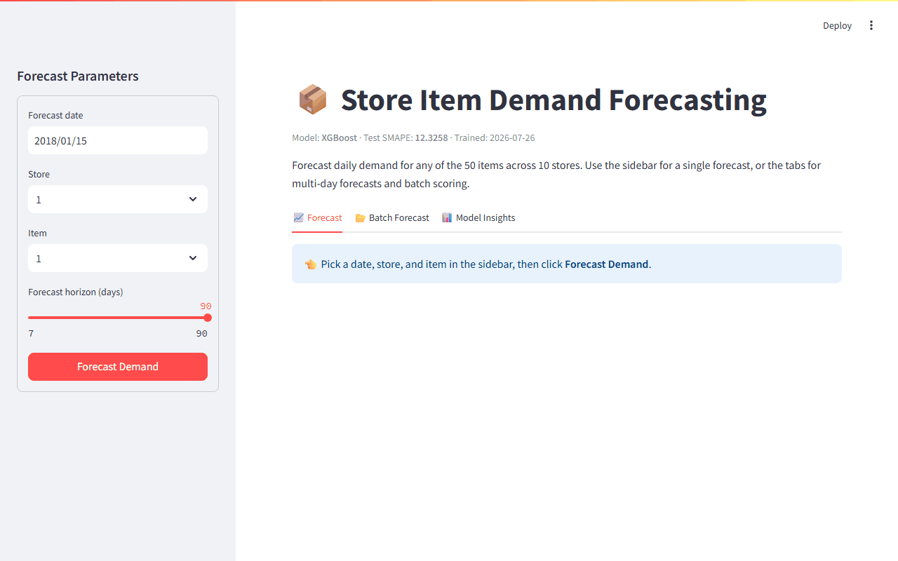

*Live dashboard: pick any store & item → 90-day forecast over historical context + SHAP explanation.*

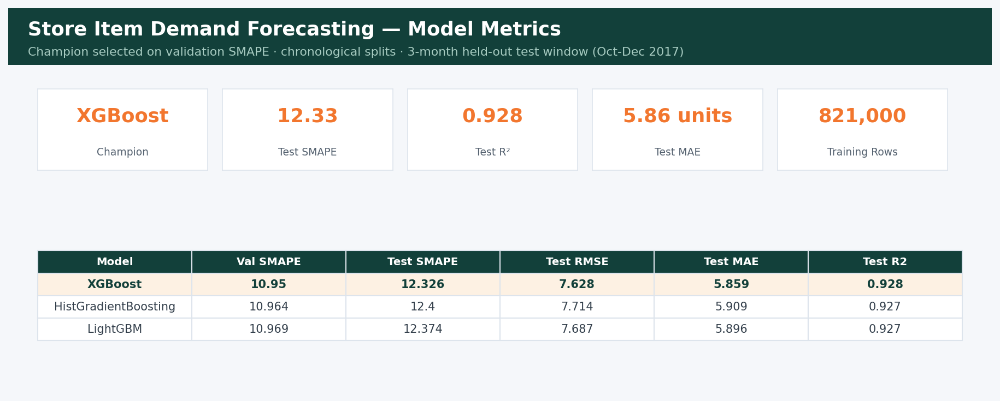


## 🎯 Business Problem

Demand forecasting drives every downstream retail decision: inventory purchasing, staffing, logistics, and promotions. Under-forecasting causes stockouts and lost sales; over-forecasting ties up capital in inventory. This project predicts **daily sales for 50 items across 10 stores** (500 concurrent time series) with a 3-month forecast horizon.

**Dataset:** [Store Item Demand Forecasting Challenge](https://www.kaggle.com/c/demand-forecasting-kernels-only) (Kaggle)
(913,000 daily records: 10 stores × 50 items × 5 years, 2013–2017). Downloaded automatically from a public mirror — no Kaggle credentials needed.

---

## 🛠️ Tech Stack

- **Data Science Core:** pandas, NumPy, scikit-learn
- **Machine Learning Models:** LightGBM, XGBoost, HistGradientBoosting
- **Explainability:** SHAP (SHapley Additive exPlanations)
- **Experiment Tracking:** MLflow
- **API & Backend:** FastAPI, Uvicorn, Pydantic
- **Frontend / Dashboard:** Streamlit, Plotly
- **Serving:** Docker, Docker Compose, Render
- **Testing:** Pytest
- **CI/CD & Containers:** GitHub Actions, GHCR, Docker (multi-stage, non-root), Trivy, Ruff, pre-commit, Dependabot

---

## 🚀 Quick Start

### 1. Local Setup (Without Docker)

```bash
git clone https://github.com/Yahya-osama-mohmamed/store-demand-forecasting.git
cd store-demand-forecasting
uv sync            # creates .venv and installs the locked dependency tree
```

Dependencies are managed with [uv](https://docs.astral.sh/uv/): `pyproject.toml`
declares them, `uv.lock` pins the entire transitive tree, and `uv sync` installs
exactly that. The lockfile is what CI and the container build install from, so
"works on my machine" and "works in the image" are the same resolution.

### 2. Run the analysis
The whole project is one notebook: [`notebooks/demand_analysis.ipynb`](notebooks/demand_analysis.ipynb).
It downloads the data, explores the seasonality, splits chronologically, builds
calendar and learned-aggregate features, tunes three gradient boosting
implementations on SMAPE with `TimeSeriesSplit`, evaluates the champion once on
the held-out quarter, and saves the artifacts the API and the Lambda export use.

```bash
uv run jupyter lab notebooks/demand_analysis.ipynb
```

Or execute it headlessly (it trains on 821k rows, so allow time):

```bash
uv run jupyter nbconvert --to notebook --execute --inplace notebooks/demand_analysis.ipynb
```

Check the trained model still clears the floor CI enforces:

```bash
uv run python scripts/check_model_quality.py
```

### 3. Browse the tracked experiments

Every tuning run is logged to a local MLflow store — hyperparameters, CV and
validation scores, full test metrics, and the champion's serialized pipeline.

```bash
uv run mlflow ui --backend-store-uri mlruns
```

### 4. Start the Applications
**FastAPI Backend (Port 8000):**
```bash
uv run uvicorn app.api:app --reload
```
Swagger documentation available at: http://localhost:8000/docs

**Streamlit Dashboard (Port 8501):**
```bash
uv run streamlit run app/streamlit_app.py
```

---

## 🐳 Running it

The published image is self-contained — the model is baked in — so nothing needs
building or training first:

```bash
docker run -p 8000:8000 ghcr.io/yahya-osama-mohmamed/store-demand-api:latest
```

```bash
curl -X POST http://localhost:8000/predict \
  -H 'Content-Type: application/json' \
  -d '{"date":"2018-01-15","store":1,"item":1}'
# {"predicted_sales":11.79,"demand_level":"Low"}
```

Interactive API docs: http://localhost:8000/docs

To run the API and the Streamlit dashboard together from source instead:

```bash
docker-compose up --build -d
```

Compose builds locally and expects `models/` to exist, so run the notebook once
first — or just use the published image above.

---

## 📂 Project Structure

```
.
├── .github/
│   ├── workflows/ci.yml              # lint, tests, dependency audit, model quality gate
│   ├── workflows/docker-publish.yml  # build → smoke test → scan → GHCR
│   ├── smoke/payload.json            # the request the smoke test actually sends
│   └── dependabot.yml
├── app/                    # Serving layer
│   ├── api.py              # FastAPI application
│   ├── schemas.py          # Pydantic request/response models
│   └── streamlit_app.py    # Streamlit dashboard
├── aws/                    # Serverless export, parity check, deploy and teardown
├── dashboard/              # Power BI report (PBIP project format)
├── figures/                # EDA and evaluation charts, written by the notebook
├── mlruns/                 # MLflow tracking store (gitignored)
├── models/                 # Metadata is tracked; binaries come from the release
├── notebooks/
│   └── demand_analysis.ipynb  # ← the project: EDA → features → models → test → save
├── reports/                # Model comparison table
├── scripts/
│   └── check_model_quality.py  # the gate CI runs before publishing
├── tests/                  # Pytest suite
├── pipeline_lib.py         # FeatureEngineer + SMAPE, shared by notebook/API/Lambda
├── Dockerfile              # Multi-stage, non-root, healthchecked
├── pyproject.toml          # Dependencies, ruff and pytest config
├── uv.lock                 # The exact tree CI and the image install
└── .pre-commit-config.yaml
```

### Why there is still a `.py` file

`pipeline_lib.py` holds `FeatureEngineer`, the SMAPE metric and the column
definitions. Not for tidiness — a pickled sklearn pipeline stores its steps *by
import path*, so a transformer defined in a notebook pickles as
`__main__.FeatureEngineer` and neither the API nor the Lambda export could load
it. Everything else lives in the notebook.

---

## 📊 Model Performance

After running the notebook, check `reports/model_comparison.csv` for detailed metrics. The primary metric is **SMAPE** (the competition metric — lower is better); leading public-leaderboard solutions score ~12.5–14.

### Methodology Notes

- **Chronological splits** — train ≤ 2017-06, validate on 2017-07..09, test on
  2017-10..12 (matching the competition's 3-month horizon). Random splits would
  leak the future into training.
- **Model selection** uses the validation window; the test window is reserved
  strictly for the final unbiased estimate.
- **Feature engineering lives inside the sklearn Pipeline** (`FeatureEngineer`
  step): calendar/cyclical features plus per-entity demand aggregates
  (store-item mean, store-item day-of-week mean, seasonal means) learned from
  training folds only. The saved `models/final_pipeline.joblib` accepts raw
  `(date, store, item)` records — no manual feature engineering at serving time,
  and any future date works.
- **Hyperparameter tuning** uses `RandomizedSearchCV` with `TimeSeriesSplit`, so
  every CV fold validates on data strictly after its training window.
- **Gain-based feature importance** for the champion is reported in
  `figures/shap_bar.png`; the learned demand aggregates dominate, which is what
  the seasonality analysis predicted.

### Why these three models?

Histogram-based gradient boosting dominates this competition's leaderboard —
deep learning generally underperforms GBMs on tabular data of this size:
1. **LightGBM** — leaf-wise growth, typically the strongest here.
2. **XGBoost** — depth-wise with strong regularization; a robust second opinion.
3. **HistGradientBoosting** — scikit-learn's native LightGBM-style GBM;
   equally competitive with zero extra dependencies.

---

## 📊 Power BI Dashboard — Demand Planning Control Tower

A four-page interactive Power BI dashboard built on the model's forecast output:

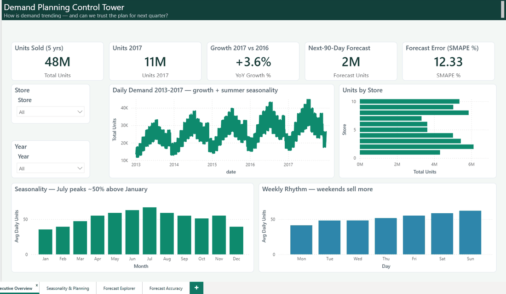

*Live usage: Executive Overview (5-year trend + growth KPIs) → Seasonality &
Planning (store × month planning grid, weekday/weekend rhythm) → Forecast
Explorer (pick any store/item → 90-day plan with history beside it) → Forecast
Accuracy (held-out quarter: actual vs forecast, error by store, champion model
card).*

Open `dashboard/DemandPlanning/DemandPlanning.pbip` with Power BI Desktop
(PBIP/PBIR project format — enable *Power BI Project files* in Preview
features).

---

## ☁️ Deployment

**AWS serverless inference** (S3 + Lambda + API Gateway, $0 idle cost): see
[`aws/README.md`](aws/README.md). The trained pipeline is exported to
dependency-light primitives (parity-verified to 1e-6 against the sklearn
pipeline — `aws/parity_check.py`) and served from a ~40MB Lambda package
with least-privilege IAM. Lambda was chosen over SageMaker deliberately:
no hourly-billing endpoint risk, permanent 1M-request free tier.

Also configured for **Render** via `render.yaml` (FastAPI service + Streamlit
dashboard). CI runs all `pytest` suites via GitHub Actions.

---

---

## 🚢 Deployment

[](https://github.com/Yahya-osama-mohmamed/store-demand-forecasting/actions/workflows/ci.yml)
[](https://github.com/Yahya-osama-mohmamed/store-demand-forecasting/actions/workflows/docker-publish.yml)

The published image is self-contained — model included — so this is all it takes:

```bash
docker run -p 8000:8000 ghcr.io/yahya-osama-mohmamed/store-demand-api:latest
curl http://localhost:8000/health
```

Images are tagged `latest`, `sha-<commit>` and semver on a release tag.

**What has to pass before an image is published**

| Stage | What it checks |
|---|---|
| Lint | `ruff` across the package |
| Tests | `pytest` with coverage, against the released model artifact |
| Dependency audit | `pip-audit` (advisory) |
| **Model quality gate** | test SMAPE ≤ 13.0, validation SMAPE ≤ 11.5, R² ≥ 0.90, forecast bias within ±10% |
| **Container smoke test** | The image is started and the real endpoints are called; the response is asserted, not just the status code |
| Image scan | Trivy, HIGH/CRITICAL (advisory) |

The quality gate is the part worth pointing at: a retrain that quietly degrades
still runs, still passes the tests, and would still build — the gate is what
stops it reaching an image.

**Model artifacts** live in the [`models-v1` release](https://github.com/Yahya-osama-mohmamed/store-demand-forecasting/releases/tag/models-v1),
not in git. CI fetches them before the tests and before the image build, so the
binaries stay versioned and immutable without bloating the repository history.

## 📄 License

This project is licensed under the MIT License.

---

## 🖼️ Output Gallery

| | |
|---|---|
| 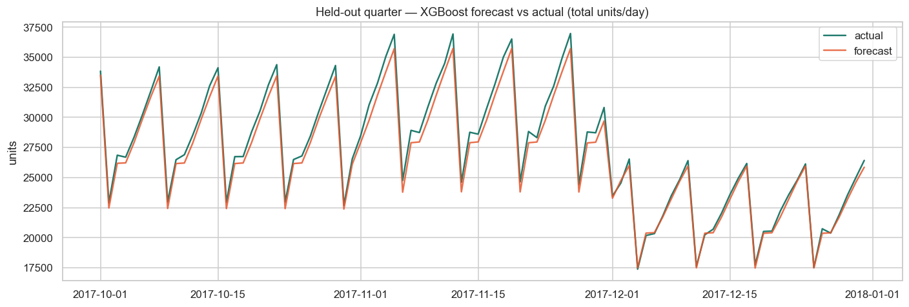 | 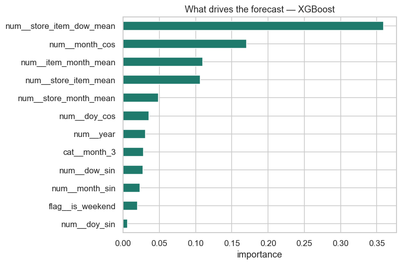 |
| 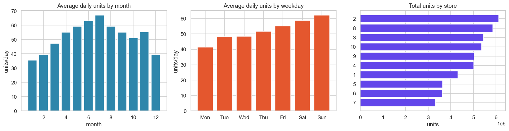 | 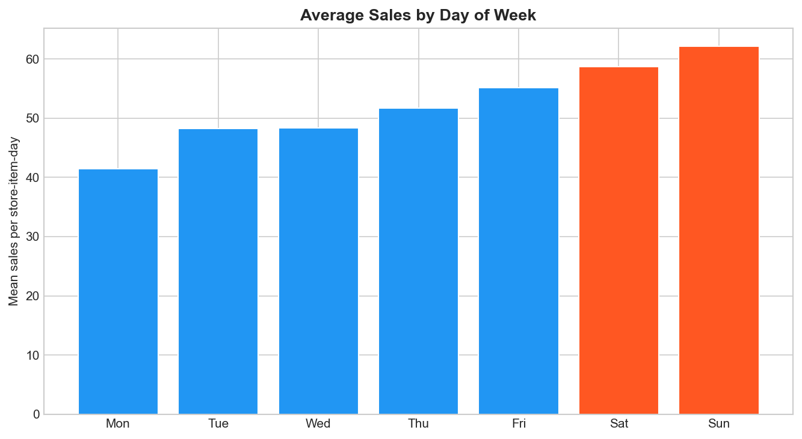 |
| 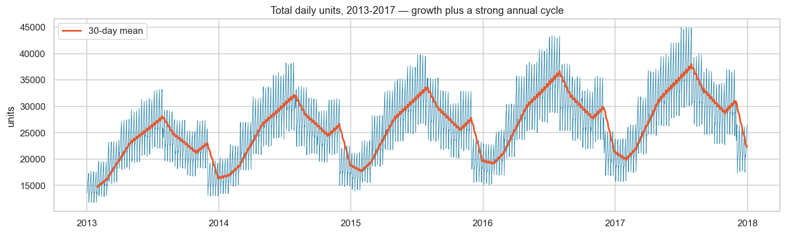 | 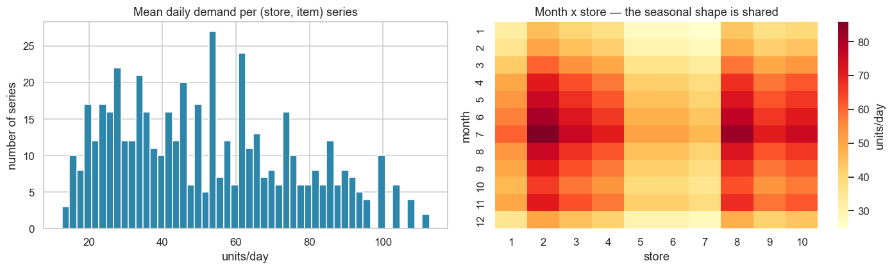 |
| 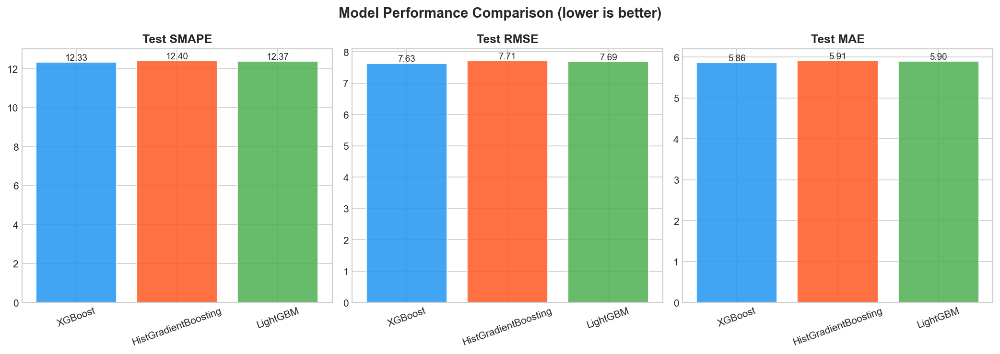 | 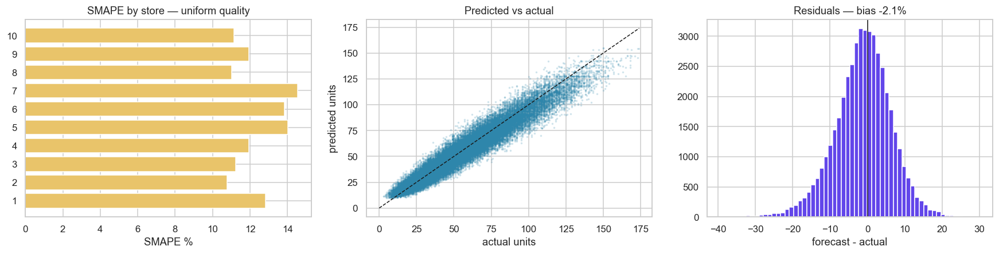 |

**AWS deployment evidence** (live before teardown — see [aws/DEPLOYMENT_LOG.md](aws/DEPLOYMENT_LOG.md)):

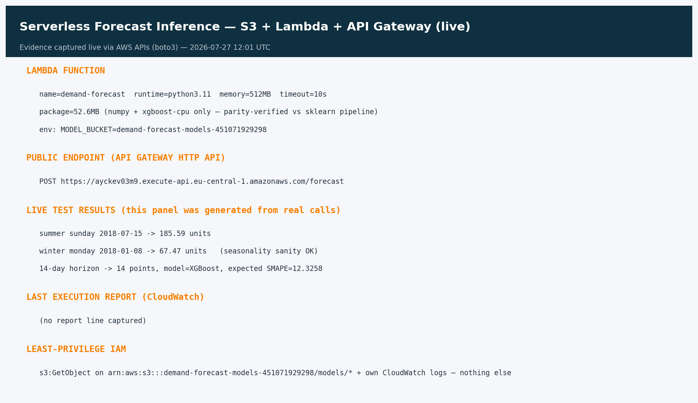
