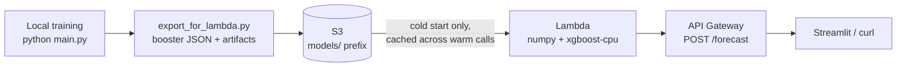

# ☁️ Serverless Inference on AWS — S3 + Lambda + API Gateway

The demand model deployed as a **$0-idle serverless service**. Same model,
two serving patterns documented side by side: the local Docker/FastAPI stack
(`app/`) and this AWS one.



## Why Lambda, not SageMaker (a design decision, not a compromise)

A SageMaker real-time endpoint bills **hourly from the moment it exists** —
idle included — with no permanent free allowance. Lambda's 1M requests/month
free tier is permanent, and an idle function costs exactly $0. For a
portfolio-scale service the correct engineering answer is the one that
cannot generate a surprise bill.

## The packaging problem, solved properly

The trained artifact is a sklearn Pipeline (custom `FeatureEngineer` +
`ColumnTransformer` + XGBoost). Shipping its pickle to Lambda would require
scikit-learn + pandas + joblib + xgboost — **over the 250MB unzipped Lambda
limit** — plus our own classes on the import path. Instead,
`export_for_lambda.py` decomposes the pipeline into primitives:

| Exported | Contents |
|---|---|
| `model_xgb.json` (2.2MB) | the XGBoost Booster, loadable by xgboost alone |
| `artifacts.json` (0.14MB) | learned aggregates, imputer medians, one-hot category orders, output column order |

`lambda_function.py` rebuilds the exact feature vector with numpy + stdlib
and predicts with **xgboost-cpu** — a ~40MB package.

**Proof, not hope:** `parity_check.py` compares the Lambda inference path
against the real pipeline on 500 random (date, store, item) triples spanning
2013–2020 — **max abs diff 0.000007**. This check must pass before deploying.

Cold-start optimization: artifacts are fetched from S3 and parsed once per
container (module-level cache) — warm invocations never touch S3.

## Runbook (in order — guardrails enforced in code)

```bash
# 0. one-time: aws configure   (IAM user access key, never root)
python -m aws.create_budget_guard you@email.com   # $0.01 alert — everything below refuses to run without it
python -m aws.export_for_lambda                   # pipeline -> primitives
python -m aws.parity_check                        # must print PARITY OK
python -m aws.upload_model  <bucket-name>         # private bucket + artifacts
bash aws/build_lambda_package.sh                  # zip: handler + numpy + xgboost-cpu
python -m aws.deploy_lambda <bucket-name>         # role (least-privilege) + function + smoke invoke
python -m aws.create_api                          # HTTP API -> prints public URL
python -m aws.test_invoke   <url>                 # e2e + seasonality sanity check
```

Nothing here needs teardown: S3 storage at this scale is pennies-free-tier,
and idle Lambda/API Gateway bill nothing.

## Least-privilege IAM (aws/iam_policy.json)

The Lambda role can do exactly two things: `s3:GetObject` on
`arn:aws:s3:::<bucket>/models/*` and write its own CloudWatch logs. No
wildcards, no write access to the bucket, no other services.

## API

```bash
curl -X POST https://<api-id>.execute-api.<region>.amazonaws.com/forecast \
  -d '{"start_date": "2018-07-01", "periods": 14, "store": 2, "item": 15}'
```

```json
{"store": 2, "item": 15,
 "forecast": [{"date": "2018-07-01", "predicted_sales": 178.85}, ...],
 "model": "XGBoost", "expected_smape": 12.3258}
```
